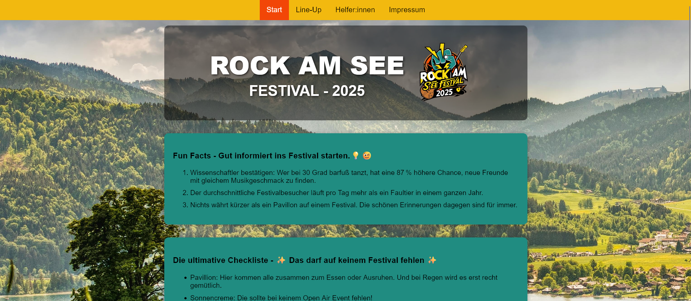
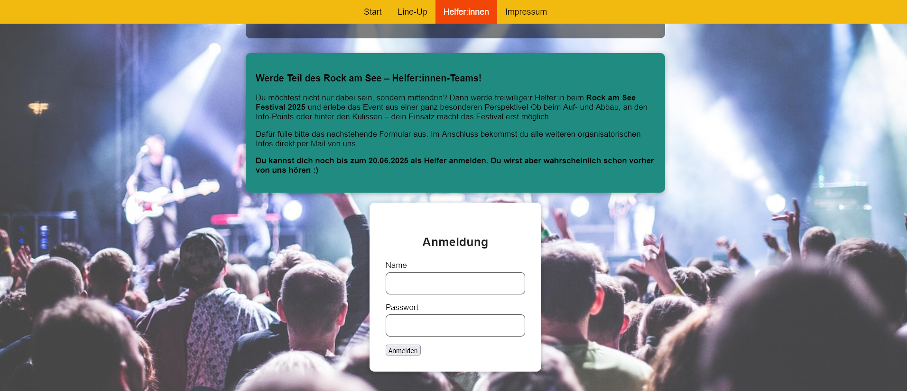
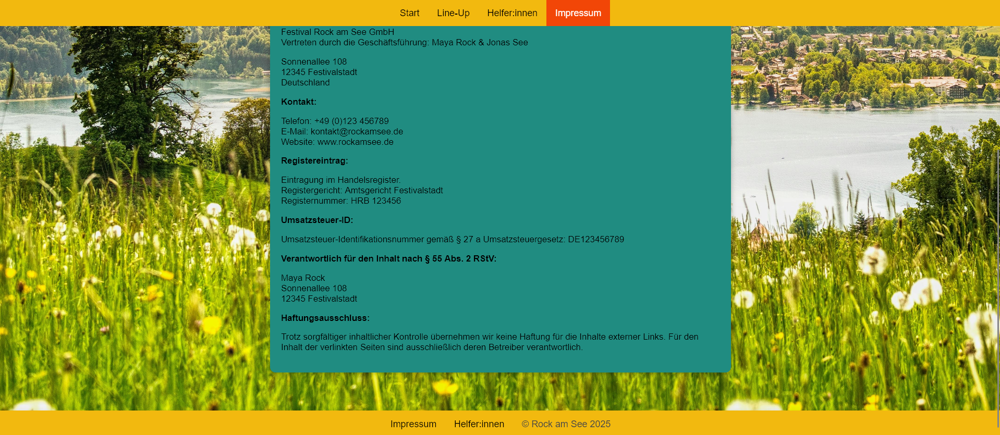
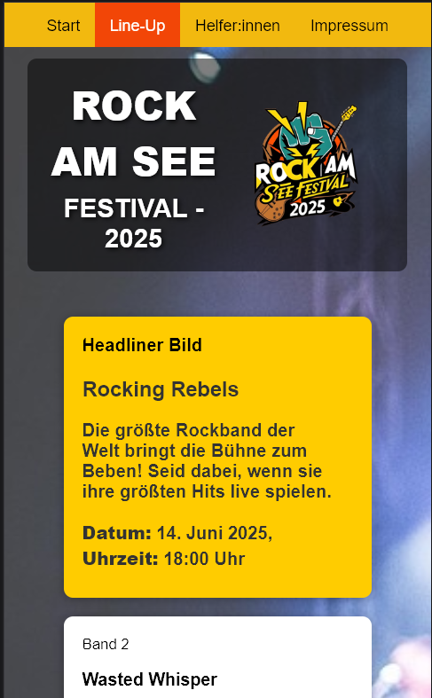

# T01 Rock am See - Festival 2025 (Web Technologies)

### Project Preview

| **Home & Info** | **Registration** |
| :---: | :---: |
|  |  |
| **Impressum** | **Mobile View of Line-Up** |
|  |  |

## Context
This project was developed as the first milestone within the "Web Technologies" module at my university. The primary objective was to apply core web development principles by building a fully responsive, multi-page website from scratch using only semantic HTML5 and CSS.

## Description
The website serves as the online representation of the German summer music festival "Rock am See". It includes four pages, all of which can be accessed via the top navigation bar. In addition to fun facts, tips, and testimonials from past festival visitors, the site provides a lineup of the bands. The "Helfer:innen" tab allows users to register as volunteers, and the "Impressum" page covers all legal information.

## How to Start/Use the Website
1. Download the Folder with all the HTML files and the CSS file, as well as the folder "Photos".
2. If needed, unzip the folder.
3. Open the folder in your file explorer and click on the file "home.html" (this should open the file in the Browser. If not, right click on the file and the "open with" > your browser.)
4. Navigate through the Website via the navigation bar on the top and enjoy. 😊

## DummyJSON Login
The application integrates with the DummyJSON API to handle user authentication. To test the login functionality, use the following credentials:
* Username: emilys
* Password: emilyspass

Note: The application successfully retrieves a JWT upon valid authentication, which is then used to authorize subsequent API requests.

## Used tools
* The logo was created with Canva AI
* The text was generated by Chat GPT and own ideas.
* The images were retrieved from https://www.pexels.com/ and https://pixabay.com/.

## Testing
The application was tested on Brave Browser, Firefox, and Chrome on different screen sizes.
